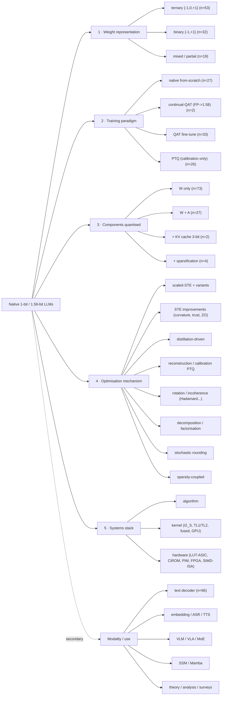

# Taxonomy of binary and ternary LLM research

Derived from `inventory.csv` (140 rows: 135 in-window primary studies + 5 pre-2023 foundational, 2026-09-07). This is the source for **§4 + the taxonomy figure + Table 1** of the paper. The generator `scripts/gen_fig1.py` re-derives all axis counts from `inventory.csv`.
Counts are papers primarily characterised by that value; many works span several axes (see "cross-cutting").

---

## Axis 1 — Weight representation

| value | n | definition | exemplars |
|---|---|---|---|
| **ternary** {-1,0,+1} (1.58-bit) | 53 | zero state included; sparsity + representational headroom | BitNet b1.58, Spectra/TriLM, BitNet a4.8/v2/2B4T, ParetoQ-T, Tequila |
| **binary** {-1,+1} (1-bit) | 32 | no zero state | FBI-LLM, BiLLM, OneBit, ARB-LLM, STBLLM, BinaryMoS, QuEST-W1 |
| **mixed / partial** | 19 | salient columns or a residual branch kept > 2-bit; multi-bit studies; complex {±1,±i} | PB-LLM, PTQ1.61, pQuant, DB-LLM, iFairy/Fairy2i, Fairy2i |
| n/a (systems / analysis / survey) | 22 | — | bitnet.cpp, Kumar scaling laws, the 4 surveys |

## Axis 2 — Training paradigm

| value | n | definition |
|---|---|---|
| **native from-scratch** | 27 | low-bit constraint present from step 0 (BitLinear-style) — the defining paradigm |
| **QAT fine-tune** | 33 | quantiser inserted into a fine-tuning / continued-training loop over a pretrained FP model |
| **PTQ** (no gradient) | 26 | calibration-only, training-free |
| **continual-QAT** | 2 | explicit FP -> 1.58-bit phase transition mid-pretraining |
| systems / analysis / survey / background | 38 | not a training method |

> The survey's scope centre is the 27 **native** + 2 **continual-QAT** works; QAT-finetune and PTQ toward <=2 bits are treated as the comparative branch (plan §6).

## Axis 3 — Components quantised

| value | n | notes |
|---|---|---|
| **W only** | 73 | weights ternary/binary, activations FP16/INT8 kept |
| **W + A** | 27 | activation quantisation as well (INT8 -> INT4 -> …); incl. one W+A+emb |
| **W + A + KV** | 2 | + 3-bit KV cache (BitNet a4.8, BitNet v2) |
| **+ sparsification** | 4 | activation/weight sparsity coupled to quantisation (a4.8, Q-Sparse, Sparse-BitNet, Sherry) |
| n/a | 23 | systems / analysis / survey |

Activation-bit distribution among W+A works: A8 dominant; A4 = BitNet a4.8 / v2, TWLA, LBLLM; A6 = DBellQuant, BWLA; A1 = QuEST, "binary W+A PTQ".

## Axis 4 — Optimisation mechanism (bucketed)

| family | ~n | members |
|---|---|---|
| **scaled-STE** (absmean/absmax/median, latent weights) | ~20 | BitNet line, Spectra, Nielsen line, LLaVaOLMoBitnet |
| **STE improvements** | ~6 | CAGE (curvature), QuEST (trust-gradient), zeroth-order STE, BEExformer (2nd-order sign) |
| **distillation-driven** | ~13 | FBI-LLM (AR), BitNet Distillation, BitDistiller, Bi-Mamba, TSLD, OneBit, TernaryCLIP, BiBERT-DMD, TeTRA |
| **reconstruction / calibration PTQ** | ~16 | BiLLM, ARB-LLM, PB-LLM, PTQ1.61, PT²-LLM, PTQTP, ICQuant, output-alignment, CAT-Q, HBLLM |
| **rotation / incoherence** | ~7 | BitNet v2 (Hadamard), HARP, influence-Walsh, TWLA (Kronecker), BWLA (OKT), spectral rotations |
| **decomposition / factorisation** | ~10 | OneBit-SVID, LittleBit, double-binary-factorisation, multi-boolean, dual trit-planes, LC-QAT VQ, Fairy2i, NanoQuant, R2Q |
| **stochastic rounding** (no STE) | 1 | Direct Quantized Training |
| **sparsity-coupled** | ~5 | Sparse-BitNet (N:M), Sherry (3:4), STBLLM (N:M), Q-Sparse (top-K), progressive-bin+pruning |
| **schedule / structural tricks** | ~8 | continual 16->1.58, deadzone-as-bias (Tequila), weight-indexing (BitTTS), extra-RMSNorm, MoS scaling experts, pQuant branch |
| n/a | ~35 | systems / analysis / survey / background |

## Axis 5 — Systems stack touched

| value | n |
|---|---|
| algorithm only | 88 |
| algorithm + kernel | 10 |
| algorithm + kernel + hardware | 4 (BitNet b1.58/2B4T, MatMul-free, Sparse-BitNet) |
| kernel only | 5 (bitnet.cpp x2, Vec-LUT, RSR-core, FairyFuse) |
| kernel + hardware | 3 |
| hardware only | 12 (PIM-LLM, BitROM, TOM, TeLLMe v1/v2, TENET, Platinum, PIM-AI, TerEffic, RSR-core, T-SAR) |
| n/a | 4 |

Kernel families in the systems corpus: **I2_S / Int2-scale**, **TL1 / TL2 lookup**, **fused ternary**, **LUT-based ASIC**, **compute-in-ROM**, **SIMD in-register LUT**, **GPU (TriRun, QuEST kernels)**.

---

## Secondary cut — modality / use

text-decoder LLM 66 · systems/hardware 18 · theory/analysis 10 · surveys 4 · **VLM 4 + VLA 1 + VLM/MoE 1** · vision/ViT 3 · text-encoder (BERT) 3 · **embedding 3** · **ASR 1 · TTS 1** · **SSM/Mamba 2** · security 2 · reasoning 1 · storage layer 1.

The non-text branches (embedding, ASR, TTS, VLM/VLA, SSM, MoE) are the material for **§8 Applications & Extensions** and are the fastest-growing slice in 2025-2026.

---

## Cross-cutting works (belong to >=3 axis branches — the "hub" papers)

- **BitNet b1.58 / 2B4T** — ternary · native · W+A · scaled-STE · full-stack.
- **BitNet a4.8 / v2** — ternary · native · W+A+KV(+sparsify) · rotation/hybrid · algo+kernel.
- **Spectra / Spectra 1.1** — ternary · native · W · scaled-STE · algo+kernel (TriRun) · scaling-law analysis.
- **MatMul-free LM** — ternary · native · W+A · GLA · full-stack (FPGA).
- **ParetoQ** — multi-bit · QAT · W · unified · scaling-law analysis.
- **Sparse-BitNet / Sherry** — ternary · native · W+sparsify · sparsity-coupled · algo+kernel+hw.

---

## Figure 1 — taxonomy tree (Mermaid; render for the paper as a clean vector)

## Table 1 skeleton (paper)

Table 1 = `inventory.csv` filtered to the ~50 substantive method papers, columns:
`id · year · weight_repr · paradigm · components · act_bits · opt family · systems layers · scale · evidence`.
Generate directly from the CSV at write-time; sort by (paradigm, year).
