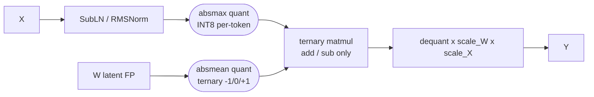
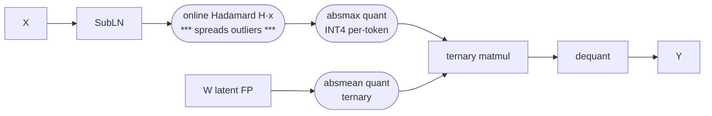
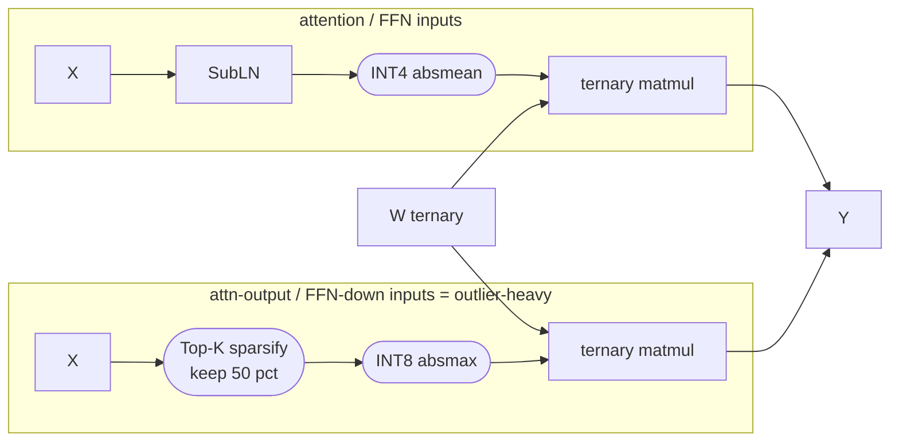

# Figure 4 — BitLinear vs H-BitLinear vs BitNet a4.8 datapath

Three linear-layer variants side by side, same layout, differences highlighted. Render the
Mermaid as a first pass; the camera-ready version should be a clean hand-drawn vector with
consistent block shapes and a shared legend. Sources: BitNet [Wang2023-BitNet /
Wang2025-BitNetJMLR], BitNet a4.8 [Wang2024-BitNetA48], BitNet v2 [Wang2025-BitNetV2].

## Legend
- rectangle = tensor op · rounded = quantiser · dashed = only in that variant
- W = weights, X = activations, `absmean` = scale by mean(|·|), STE on all quantiser backward paths

## (a) BitLinear  (BitNet b1.58) — W1.58 A8

## (b) H-BitLinear  (BitNet v2) — W1.58 A4 native

Key difference vs (a): the **online Hadamard rotate before the activation quantiser** lets
the activation quantiser drop from INT8 to INT4 with minimal ppl loss; weights unchanged.

## (c) BitNet a4.8 datapath — hybrid quant + sparsify

Key difference vs (a): activation path **splits** — INT4 for well-behaved inputs, and
Top-K sparsify → INT8 for the outlier-heavy intermediate states; squared-ReLU FFN gate
gives ~80 % activation sparsity; KV cache quantised to 3-bit (not shown).

## What the three-panel figure should make obvious
1. All three keep a full-precision **latent weight** and use STE — only the forward quantisers differ.
2. Going below A8 requires either a **rotation** (v2) or a **hybrid split + sparsify** (a4.8); plain INT4 on all activations diverges.
3. The ternary matmul block is identical in all three — the arithmetic saving is the same; the variants are all about feeding it lower-precision activations safely.
